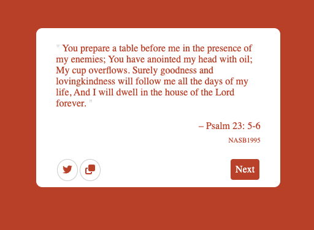

# Bible Verses

A web app that selects and shows Bible verses in the style of a random quote generator.

Built for the freeCodeCamp front-end apis certificate.

## Tools

Libraries
- React
- Redux
- FontAwesome

Dev
- Typescript
- Stylus
- Webpack

## Build

Run `npm install` and then `npm run build`

`dist/` will then contain all the distributables
